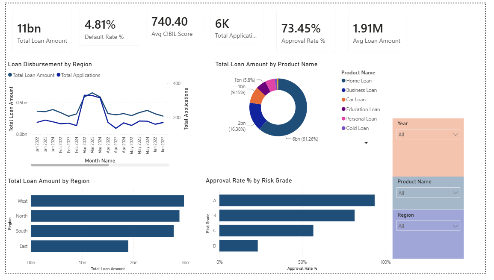
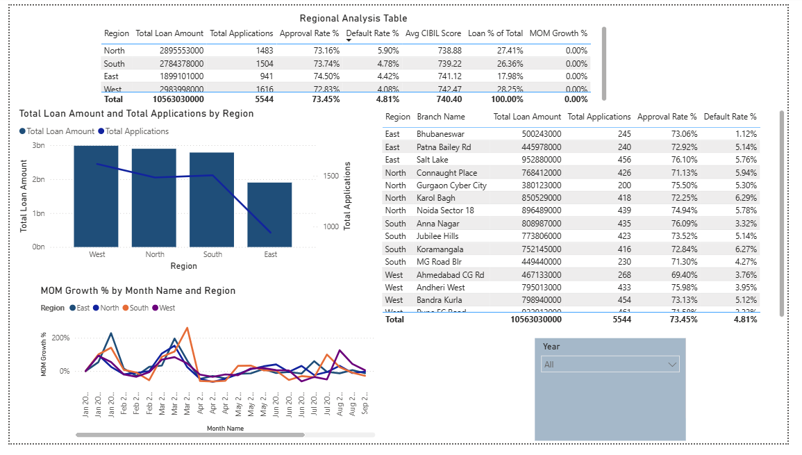
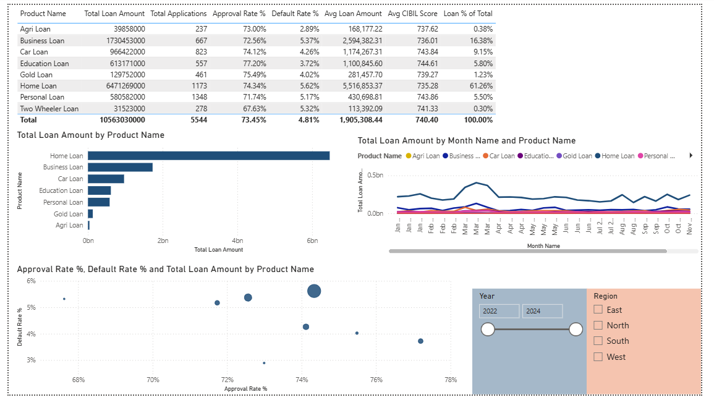
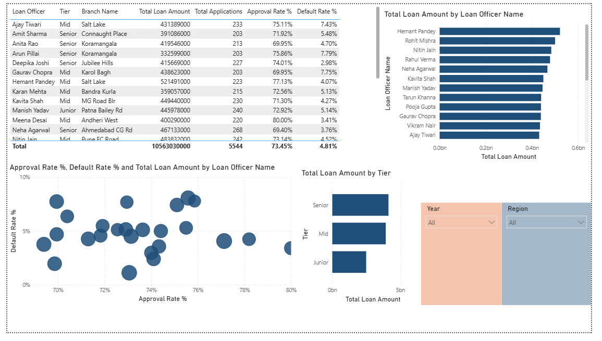
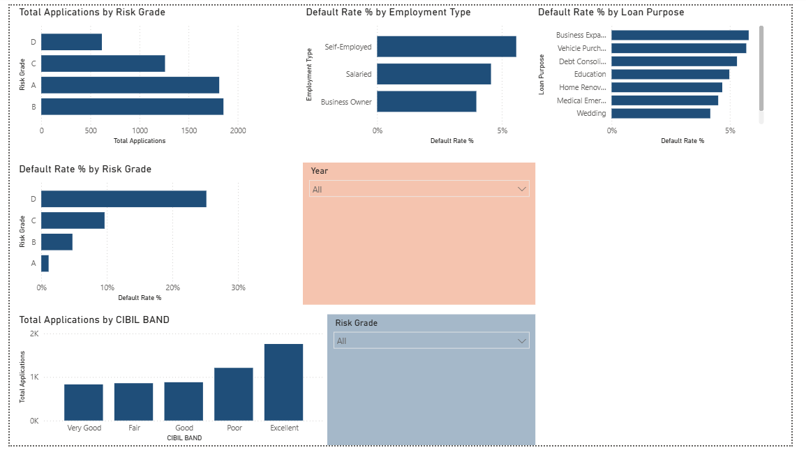

# BFSI Bank Loan Performance Dashboard

A 5-page Power BI dashboard analyzing a ₹10.5 Billion retail loan portfolio — built to demonstrate end-to-end data modeling, advanced DAX, and business-focused analytics for BFSI decision-making.

## Project Overview

This project simulates a retail bank's loan book across 15 branches, 25 loan officers, 4 regions, and 8 loan products over a 2.5-year period (Jan 2022 – Jun 2024). The goal was to go beyond building charts and produce a dashboard that a credit risk team, regional manager, or product head could actually use to make decisions.

**Dataset scale:**
- 5,544 loan applications
- ₹10.56 Billion total disbursement
- 3 related tables (Star Schema): Loan Applications, Loan Officer Master, Branch Master
- 2.5 years of transactional data with realistic seasonality (financial year-end spike in March, festive season demand in Oct–Nov, year-end slowdown in December)

## Why This Project

With 5 years of leadership experience in BFSI sales, I wanted a portfolio project that reflected the kind of analysis a bank's analytics team actually does — not just a generic retail sales dashboard. This project combines that domain background with hands-on Power BI and DAX skills built through self-study.

## Dashboard Pages

### 1. Executive Summary
High-level KPIs for leadership: total disbursement, approval rate, default rate, average CIBIL score, and monthly trend with seasonality.

### 2. Regional Analysis

Region and branch-level breakdown of loan volume, approval/default rates, and month-over-month growth volatility by region.

### 3. Product Analysis

Performance comparison across 8 loan products, including a risk/quality scatter plot identifying which products combine high approval rates with low default rates.

### 4. Officer Performance

Individual loan officer performance — disbursement volume, approval/default rate, and tier-wise (Senior/Mid/Junior) comparison.

### 5. Risk Analysis

Default rate broken down by risk grade, employment type, loan purpose, and CIBIL score band — built to surface where credit risk is concentrated.

## Tools & Techniques

- **Power BI Desktop** — data modeling and visualization
- **Star Schema** data model with 3 tables and 4 relationships (Date, Branch, and Officer dimension tables connected to a central Loan Applications fact table)
- **20 DAX measures**, including:
  - Core aggregations: `SUM`, `COUNT`, `AVERAGE`, `DIVIDE`
  - Filter context manipulation: `CALCULATE`, `ALL`, `ALLEXCEPT`, `ALLSELECTED`
  - Time Intelligence: `TOTALMTD`, `TOTALYTD`, `PREVIOUSMONTH`, `SAMEPERIODLASTYEAR`, Month-over-Month and Year-over-Year growth %
  - Rolling averages using `DATESINPERIOD`
- Full documentation of all measures in [`dax_measures.md`](dax_measures.md)

## Key Business Insights

31 business insights were documented across all 5 pages — full list in [`insights.md`](insights.md). A few highlights:

- **Home Loans account for 61% of the entire portfolio** — a concentration risk that leaves the bank heavily exposed to any slowdown in the real estate market.
- **Education Loans are the highest-quality product in the book** — best approval rate (77.2%) and lowest default rate (3.7%) — yet make up only 5.8% of disbursement. A clear, underexploited growth opportunity.
- **Self-employed borrowers and Business Expansion loans carry the highest default risk**, suggesting collateral and documentation requirements should be tightened for this segment.
- **March consistently shows an 80–90% spike in disbursement** across both years in the dataset, confirming financial year-end demand is a predictable, plannable pattern rather than noise.
- **Risk grading is validated by the data** — default rate increases progressively from Grade A to Grade D, confirming the credit model is functioning as intended.

## Dataset

A synthetically generated, realistic dataset built in Excel and modeled into a 3-table Star Schema in Power BI. Available in [`dataset/`](dataset/).

## Note on Data

This dataset is synthetically generated for portfolio and learning purposes — it is not real bank data. Patterns (seasonality, risk-grade default correlation, regional distribution) were deliberately built in to allow for realistic, meaningful analysis.

---

**Author:** Harsh Yadav
**Connect:** [LinkedIn](https://linkedin.com/in/harsh-yadav) | [GitHub](https://github.com/honey7114)
